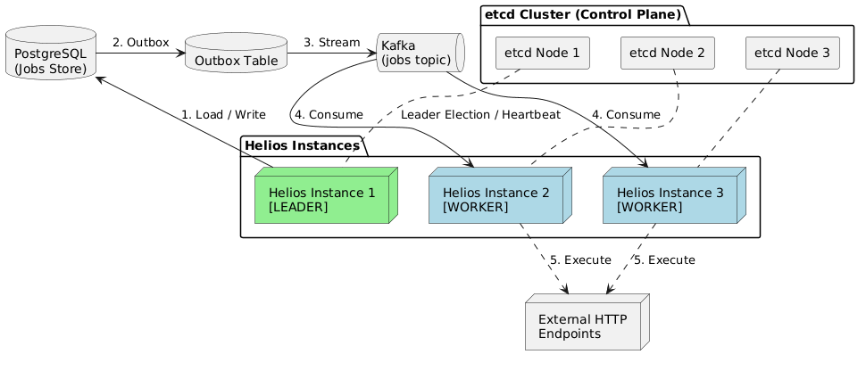

# Helios

Distributed cron job orchestration with Spring Boot, PostgreSQL, Kafka, and etcd leader election.


## Documentation
| Doc | What's inside |
|---|---|
| [Architecture](docs/architecture.md) | System design, data flow, Kafka/etcd/DB interactions |
| [Setup](docs/setup.md) | Local dev environment, Docker Compose, env vars |
| [Tradeoffs](docs/tradeoffs.md) | Why Spring Boot/etcd/Kafka/PostgreSQL, alternatives considered |
| [API Reference](docs/api-reference.md) | Endpoints, request/response formats |
| [Deployment](docs/deployment.md) | Runtime packaging and environment shape |
| [FAQ](docs/faq.md) | Common questions |

## Overview
Helios is a Spring Boot service that stores cron-defined jobs, elects one leader via etcd, and dispatches due work through Kafka using a transactional outbox table. Follower nodes run the Kafka worker listener and execute HTTP jobs based on payload JSON.  
The codebase is currently structured as one deployable service scaled into multiple instances (see `docker-compose.yml`) with role behavior controlled at runtime.

## Key features
- REST API to create, list, fetch, delete, and bulk-create jobs.
- PostgreSQL persistence with Flyway migrations and JSONB payload storage.
- etcd-based leader election (`/helios/leader`) with lease keep-alive.
- Outbox pattern for Kafka dispatch (`outbox_events` -> `jobs` topic).
- Scheduled dispatch loop (leader-only) and worker execution loop (Kafka consumer).

## High-level architecture


For deeper flow diagrams and model details, see [docs/architecture.md](docs/architecture.md).


## Tech stack
- Java 25
- Spring Boot 4.1.0
- Spring Data JPA + Hibernate
- Flyway
- Apache Kafka (`spring-kafka`)
- etcd (`jetcd`)
- PostgreSQL
- Maven Wrapper (`mvnw`)

## Quick start
```powershell
cd d:\Projects\helios\helios
$env:DB_PASS="your_postgres_password"
$env:HELIOS_INSTANCE_ID="helios-local"
.\mvnw.cmd spring-boot:run "-Dspring-boot.run.jvmArguments=-Dhelios.instance.id=$env:HELIOS_INSTANCE_ID"
```

See full setup in [docs/setup.md](docs/setup.md).

## Installation
Use the step-by-step guide in [docs/setup.md](docs/setup.md).

## Usage examples
Create one job:
```bash
curl -X POST http://localhost:8080/api/v1/jobs/create \
  -H "Content-Type: application/json" \
  -d "{\"name\":\"Ping job\",\"cronExpression\":\"*/30 * * * * *\",\"jobType\":\"HTTP\",\"payload\":\"{\\\"url\\\":\\\"https://httpbin.org/get\\\",\\\"method\\\":\\\"GET\\\",\\\"headers\\\":{}}\",\"maxRetries\":3}"
```

List jobs:
```bash
curl http://localhost:8080/api/v1/jobs
```

## Project structure
```text
helios/
├── src/main/java/com/akshadip/helios
│   ├── controllers/       # REST endpoints
│   ├── services/          # Job, outbox, listener, worker services
│   ├── leader/            # etcd election + schedulers + dispatch
│   ├── repositories/      # JPA repositories
│   ├── models/            # JPA entities
│   ├── config/            # Spring @Configuration beans
│   └── worker/            # Job executors
├── src/main/resources
│   ├── application*.properties
│   └── db/migration/      # Flyway SQL migrations
├── src/test/java          # Spring Boot context test
├── Dockerfile
└── docker-compose.yml
```


## Contact / maintainers
- Primary maintainer: `Akshadip`
