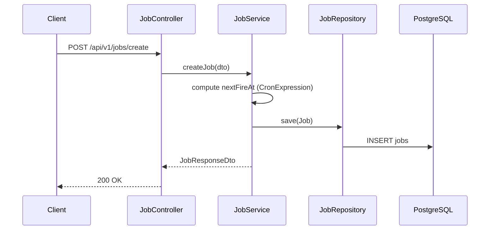
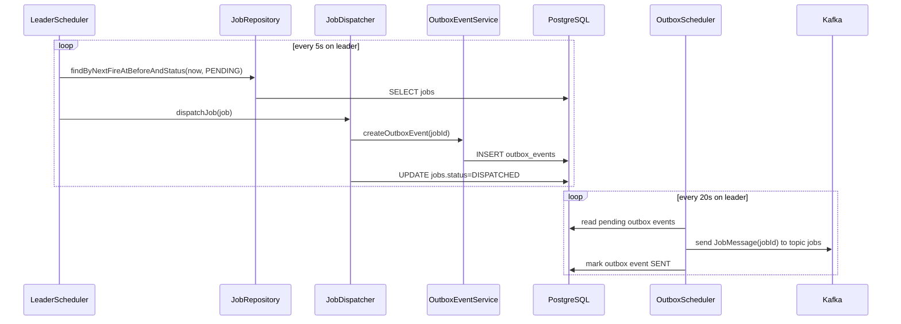
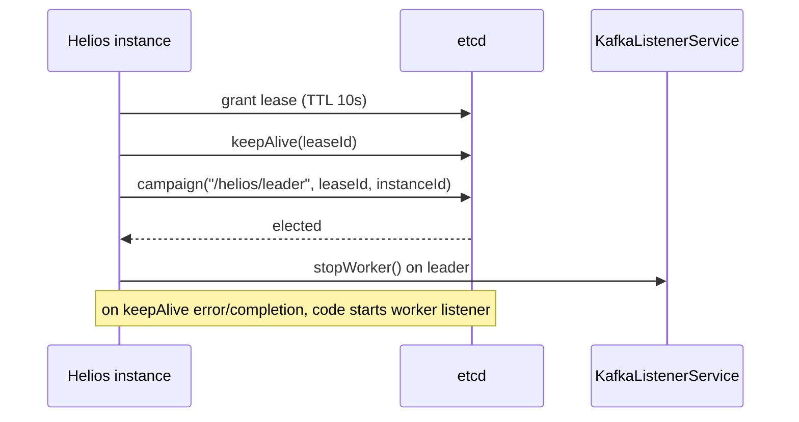
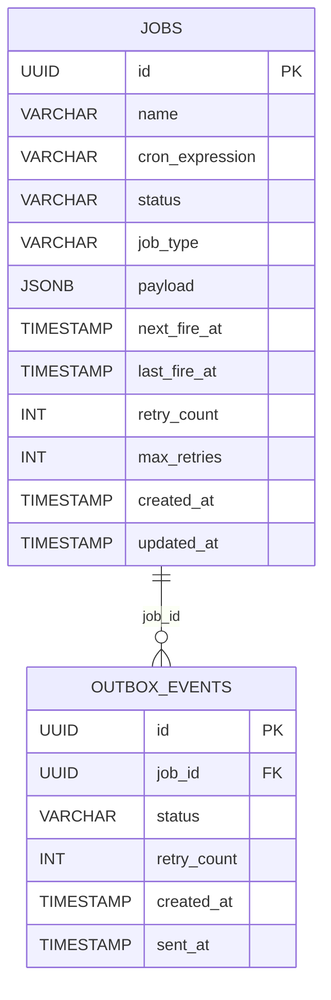

## Architecture
Helios is a single Spring Boot service deployed as multiple instances. One instance becomes leader (etcd election) and dispatches due jobs; follower instances consume Kafka messages and execute the actual work.

## Component breakdown
- **Controller layer**: `JobController` exposes `/api/v1/jobs*` endpoints.
- **Service layer**: `JobService`, `OutboxEventService`, `WorkerService`, `KafkaListenerService`.
- **Persistence layer**: `JobRepository`, `OutboxEventRepository` over PostgreSQL tables `jobs` and `outbox_events`.
- **Coordination**: `EtcdLeaderElectionService` manages lease + election key `/helios/leader`.
- **Messaging**: `OutboxScheduler` publishes `JobMessage` to Kafka topic `jobs`; `WorkerService` consumes.

## Request flow (REST -> DB)

## Leader + Kafka dispatch flow

## etcd interaction flow

## Data model

## Data Model

Helios persists scheduling metadata and dispatch state in PostgreSQL using two primary tables:

* **`jobs`** – Stores scheduled jobs, execution metadata, retry information, and the next scheduled execution time.
* **`outbox_events`** – Stores events awaiting publication to Kafka, enabling reliable message delivery through the transactional outbox pattern.

---

## Messaging Architecture

Helios uses Apache Kafka to decouple job scheduling from job execution.

When the leader determines that a scheduled job is ready to run, it writes an outbox event within the same database transaction as the job state update. A background publisher then publishes the event to the `jobs` topic, allowing worker instances to consume and execute jobs independently.

This design provides:

* Reliable event delivery through the transactional outbox pattern.
* Horizontal scaling by distributing work across multiple consumers.
* Loose coupling between scheduling and execution.

---

## Leader Election

Leader election is coordinated through etcd using leases and leader election primitives.

Every Helios instance participates in the election process. At any point in time:

* Exactly one instance acts as the scheduler.
* Remaining instances continue operating as workers.
* Leadership automatically transfers when the active leader loses its lease or becomes unavailable.

The newly elected leader resumes scheduling using the persisted state stored in PostgreSQL, ensuring scheduling continuity without relying on in-memory state.

---

## Job Execution

Worker instances consume job messages from Kafka and execute the configured HTTP requests defined in the job payload.

Each execution updates the corresponding job state, including retry information and execution timestamps, allowing the scheduler to make future scheduling decisions based on persisted state.

Because execution is driven through Kafka rather than direct invocation, workers can scale independently of the scheduling component.

---

## Scalability

Helios is designed to scale horizontally by deploying multiple identical application instances.

Scalability characteristics include:

* A single elected leader responsible for scheduling.
* Multiple worker instances processing jobs in parallel.
* Kafka providing workload distribution across consumers.
* Stateless application instances with scheduling state persisted in PostgreSQL.
* Automatic leader failover without manual intervention.

As additional worker instances are added, job execution capacity increases while scheduling remains coordinated through leader election.

---

## Reliability

Helios incorporates several mechanisms to improve reliability during distributed execution:

* **Leader Election** — Ensures only one scheduler is active at a time.
* **Transactional Outbox** — Prevents database updates and Kafka publication from becoming inconsistent.
* **Persistent Job State** — Scheduling decisions are based on database state rather than application memory.
* **Retry Support** — Failed job executions and message publications can be retried according to their configured retry policy.
* **Automatic Recovery** — When leadership changes, the new leader resumes scheduling using persisted job state, minimizing the risk of missed executions.

These mechanisms allow the system to continue operating correctly even when individual application instances fail.

---
**Related docs:** [README](../README.md) · [Tradeoffs](tradeoffs.md) · [Setup](setup.md) · [API Reference](api-reference.md)  

