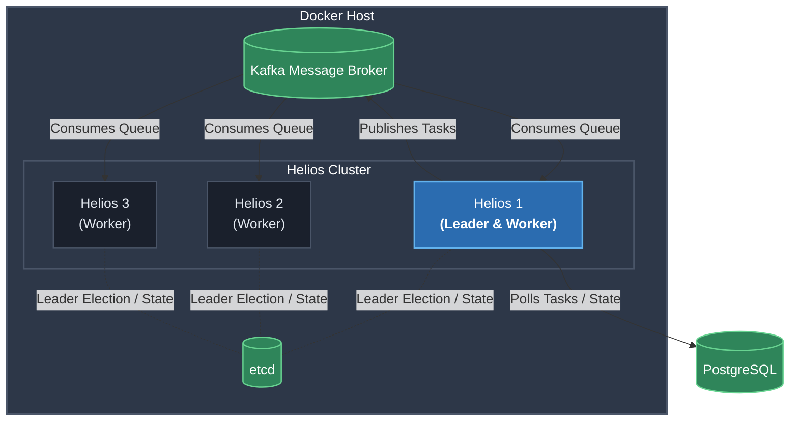

# Deployment

This guide explains how to build and deploy Helios using the provided Docker artifacts.

## Deployment Overview

A typical deployment consists of:

* Three Helios application instances
* One etcd instance for leader election
* One Kafka broker for job distribution
* One PostgreSQL database for persistent storage

Each Helios instance runs the same application image. Leader election determines which instance schedules jobs, while all instances are capable of executing work received from Kafka.

---

## Build the Application

Build the application JAR using Maven:

```powershell
cd d:\Projects\helios\helios
.\mvnw.cmd clean package
```

The packaged application is generated under:

```text
target/helios-0.0.1-SNAPSHOT.jar
```

---

## Build the Docker Image

Build the application image:

```powershell
docker build -t helios .
```

The Docker image starts the application using:

```dockerfile
ENTRYPOINT ["java","-jar","app.jar"]
```

---

## Deploy with Docker Compose

Start the distributed deployment:

```powershell
docker compose up -d
```

The default Compose configuration launches:

| Service | Purpose                                  |
| ------- | ---------------------------------------- |
| etcd    | Leader election and cluster coordination |
| Kafka   | Job distribution                         |
| helios1 | Helios application instance              |
| helios2 | Helios application instance              |
| helios3 | Helios application instance              |

By default, the application instances are exposed as:

| Instance | Host Port |
| -------- | --------: |
| helios1  |      8081 |
| helios2  |      8082 |
| helios3  |      8083 |

---

## Runtime Configuration

Each Helios instance requires:

* A unique `INSTANCE_ID`
* Database credentials
* Kafka bootstrap server
* etcd endpoint
* Active Spring profile

Example environment variables:

| Variable                         | Example            |
| -------------------------------- | ------------------ |
| `INSTANCE_ID`                    | `helios1`          |
| `DB_PASS`                        | `your_password`    |
| `SPRING_PROFILES_ACTIVE`         | `docker`           |
| `spring.kafka.bootstrap-servers` | `kafka:9092`       |
| `helios.etcd.endpoint`           | `http://etcd:2379` |

---

## Database

Helios requires a PostgreSQL database before the application starts.

The database stores:

* Scheduled jobs
* Execution state
* Retry metadata
* Transactional outbox events

The provided Docker Compose configuration expects PostgreSQL to be available separately.

---

## Deployment Architecture


---

## Scaling

Helios is designed to scale horizontally.

Additional application instances can be added without changing the application itself. Every instance participates in leader election, while Kafka distributes work across available consumers.

Execution throughput primarily depends on:

* Number of worker instances
* Kafka partition count
* Database capacity
* External service response times

---

## Updating the Application

To deploy a new version:

1. Build a new application JAR.
2. Build a new Docker image.
3. Replace the running containers with the updated image.
4. Allow the cluster to elect a leader automatically.

Because scheduling state is stored in PostgreSQL, leadership can move between instances without losing scheduled jobs.

---

## Troubleshooting

| Issue                      | Possible Cause         | Resolution                                        |
| -------------------------- | ---------------------- | ------------------------------------------------- |
| Application fails to start | PostgreSQL unavailable | Verify database connectivity and credentials      |
| Leader is not elected      | etcd unavailable       | Confirm the etcd service is running and reachable |
| Jobs are not executed      | Kafka unavailable      | Verify Kafka is running and accessible            |
| Jobs remain pending        | No active leader       | Check leader election and etcd connectivity       |

---

**Related docs:** [README](../README.md) · [Setup](setup.md) · [Architecture](architecture.md)
